# Frontend Mentor - Multi-step form solution

This is a solution to the [Multi-step form challenge on Frontend Mentor](https://www.frontendmentor.io/challenges/multistep-form-YVAnSdqQBJ). Frontend Mentor challenges help you improve your coding skills by building realistic projects. 

## Table of contents

- [Overview](#overview)
  - [The challenge](#the-challenge)
  - [Screenshots](#screenshots)
- [My process](#my-process)
  - [Built with](#built-with)
  - [What I learned](#what-i-learned)
  - [Continued development](#continued-development)
  - [Useful resources](#useful-resources)

## Overview

### The challenge

Users should be able to:

- Complete each step of the sequence
- Go back to a previous step to update their selections
- See a summary of their selections on the final step and confirm their order
- View the optimal layout for the interface depending on their device's screen size
- See hover and focus states for all interactive elements on the page
- Receive form validation messages if:
  - A field has been missed
  - The email address is not formatted correctly
  - A step is submitted, but no selection has been made

### Screenshots

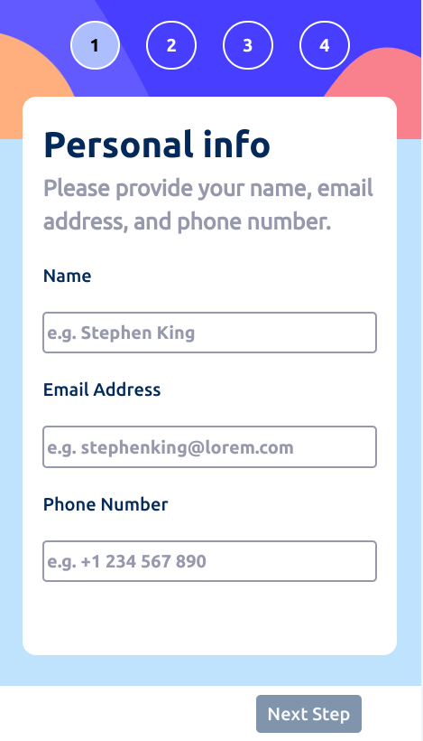

***

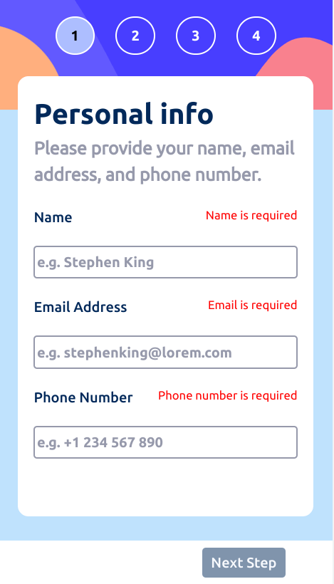

***

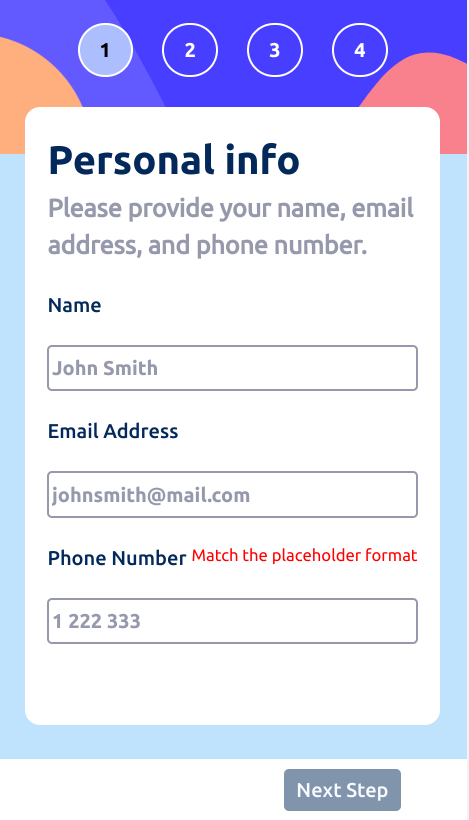

***

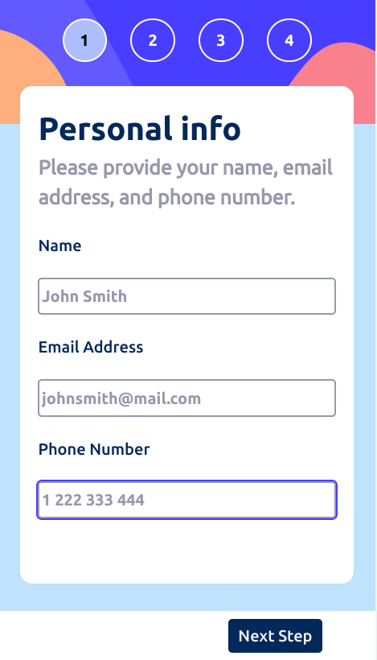

***

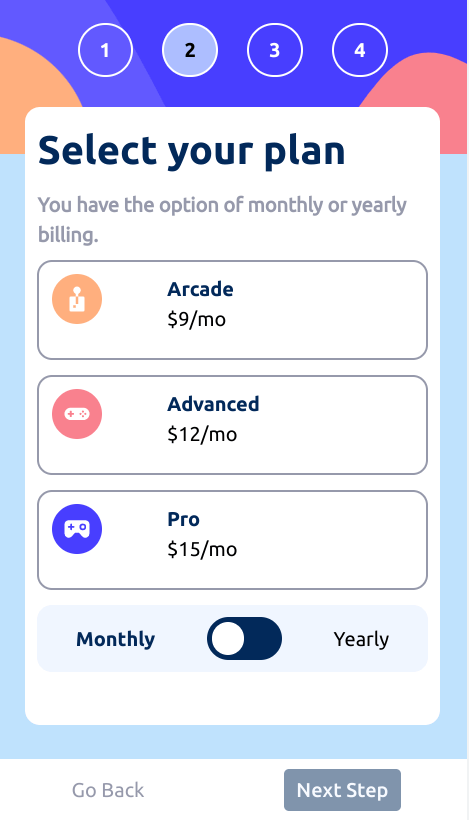

***

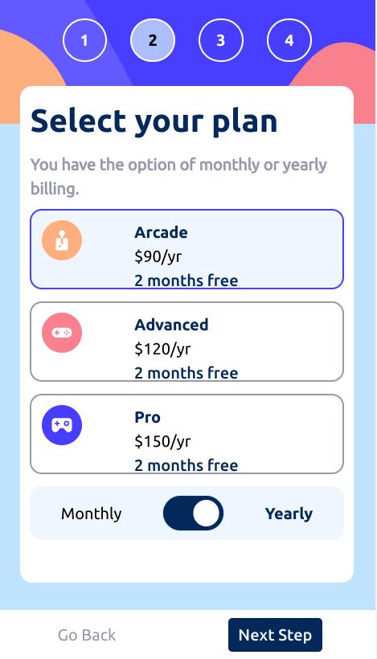

***

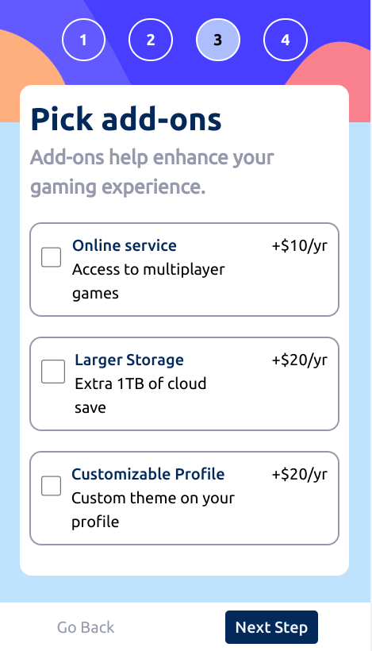

***

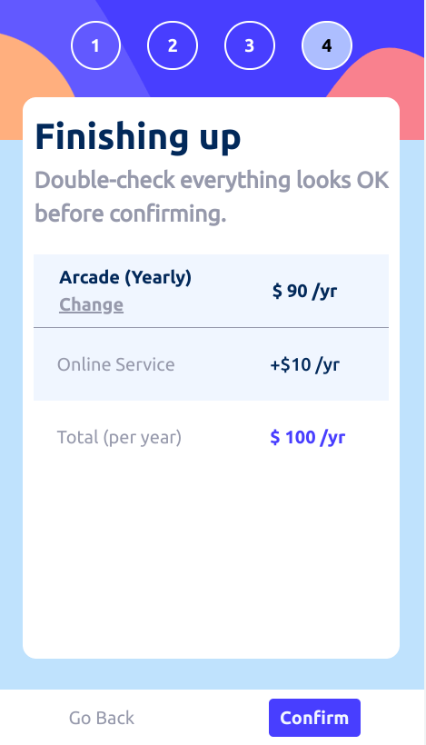

***

***

***

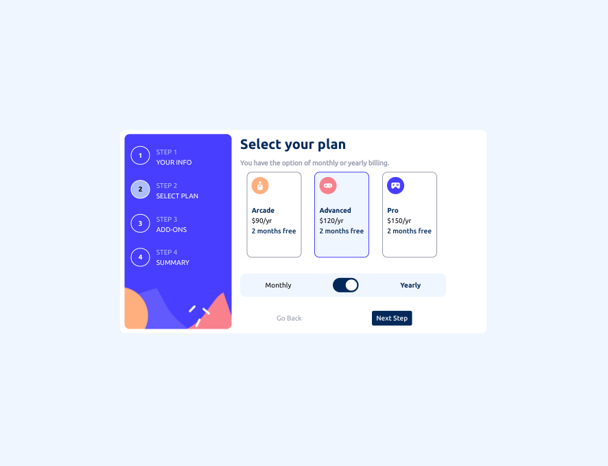

***

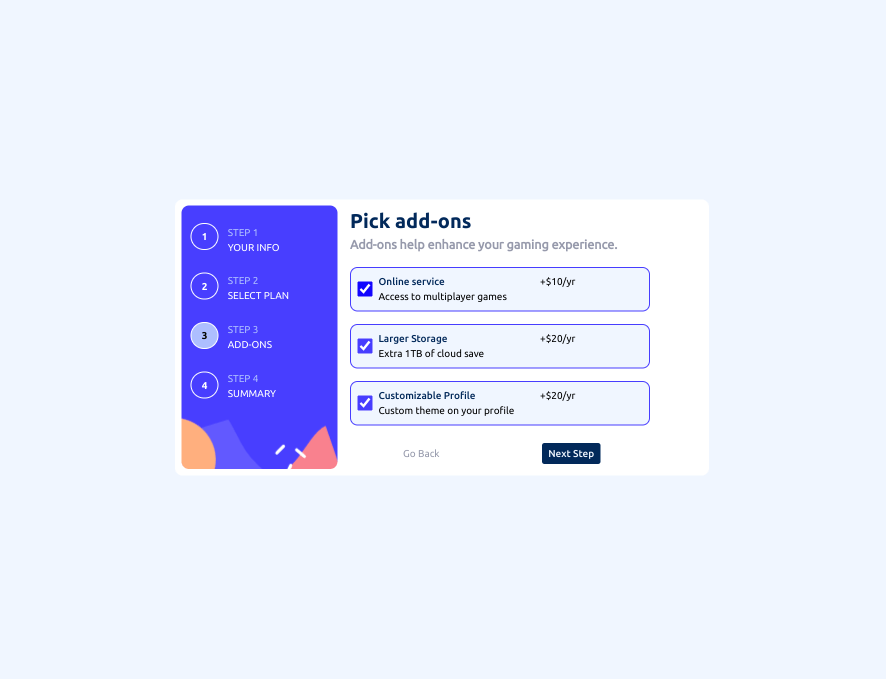

***

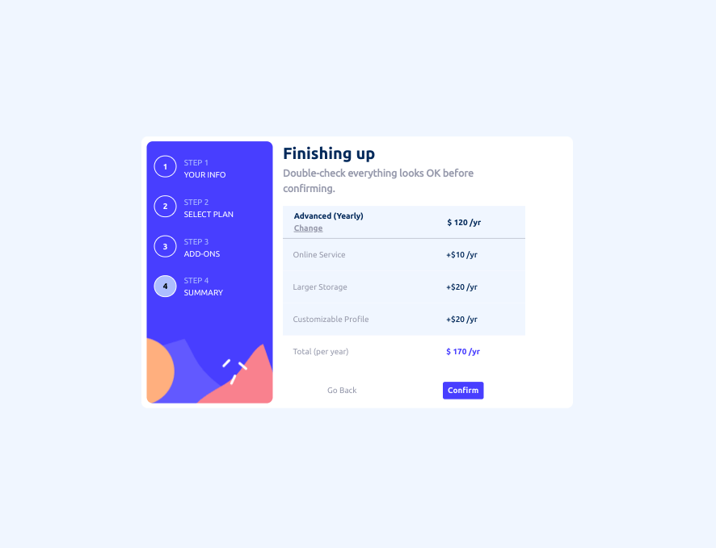

***

***

## My process

### Built with

- Semantic HTML5 markup
- CSS custom properties
- Flexbox
- CSS Grid
- Mobile-first workflow
- [Angular](https://angular.io/)
- [Angular CLI](https://github.com/angular/angular-cli) version 15.2.5.

### What I learned

I probably would use a library for a multi-step form.  But conceptually, I think it is important to understand what the libraries are doing to achieve the functionality.  I have used this design 3 times now and it is interesting to see the various complications that arise in making a multi-step form. 

Not a lot of great resources on angular multi-step forms.

Noticed an issue with past project's html where I used a div inside an li.  This is incorrect although it doesn't really affect the code.  

Passing variables to a child component complicated matters here.  I had problems in passing the child's event object up to the parent.  I tried to use a FormArray and push the checkbox name to the array but ultimately, using a FormGroup and booleans made for easier development.  

The calculation of the total value is not really optimized.  I carried over my previous idea of using a lookup object, whether it really helped or not is debatable.  The lookup object could be replaced with just more advanced ngIf conditionals in the html.  You could use ng-templates and else conditions for all values of the multiStep object.  

Carried over all styles from past implementation and placed them in the global styles.css file.  Segmenting the css code per component can be done later.  

Problems with navbar styling.  The number circles are not lined up correctly with the step text.  I think a rework of the html may be required to help ensure they line up exactly.  

Also, styling is weak because of an explicit height is not set different steps cause the container to shrink or grow.  I had the error messages originally appear under the inputs and that created a similar problem.  Having the error messages and labels inside the same div creates an issue on very small screens where the text will expand past one line.  

Although the original design doesn't disable the next button, I think it is a better approach that helps reduce writing extra checks in the submit method.

Didn't use router.  Could have had the 'Thank You' screen be its own component and on its own route.  Could have put that component inside the form-container and toggled between the 2 components with an ngIf.  

### Continued development

- Accessibility problems with the radio buttons?
- Routing ?
- Styling tweaks for more screen sizes
- Break this down into more components ?  
- Typescript improvements

### Useful resources

- [Blog](https://medium.com/@7hwyl/how-to-pass-a-function-to-a-child-component-in-angular-719fc3d1ee90) - pass function to child
- [YouTube](https://www.youtube.com/watch?v=9BRNNQPZCsU) - Calling parent component method from child component using @Output() decorator in angular
- [YouTube](https://www.youtube.com/watch?v=DzBNN1ntLgQ) - Multi-Step form | Angular | stepper | Reactive Form | Part-1
- [Stack Overflow](https://stackoverflow.com/questions/55037768/updating-value-in-the-child-component-on-value-changes-in-the-parent-component) - updating value on changes
- [Blog](https://blog.profanis.me/blog/reactive-forms-in-parent-child-components) - reactive forms in parent child components
- [Stack Overflow](https://stackoverflow.com/questions/38547389/how-can-i-pass-the-formgroup-of-a-parent-component-to-its-child-component-using) - formgroup from parent to child
- [KeyHole Software](https://keyholesoftware.com/2022/09/26/complex-reactive-forms-in-angular/) - complex reactive forms
- [YouTube](https://www.youtube.com/watch?v=iFa091DWxgo) - angular reactive forms with multiple checkboxes | Form array in angular | Angular tutorials
- [PositronX](https://www.positronx.io/angular-checkbox-tutorial/) - angular checkbox tutorial
- [Stack Overflow](https://stackoverflow.com/questions/42918423/angular-how-do-i-emit-an-event-up-through-multiple-nested-components/68784117) - emit an event up through multiple nested components
- [Digitized Post](http://www.digitizedpost.com/angular-checkbox-example-using-reactive-forms/) - checkbox reactive forms
- [Blog](https://www.angularjswiki.com/angular/understanding-angulars-ngif-else-then-with-examples/) - ngif else
- [LogRocket Blog](https://blog.logrocket.com/building-type-safe-dictionary-typescript/) - typesafe dictionary
- [Stack Overflow](https://stackoverflow.com/questions/4964691/super-simple-email-validation-with-javascript) - super simple email validation
